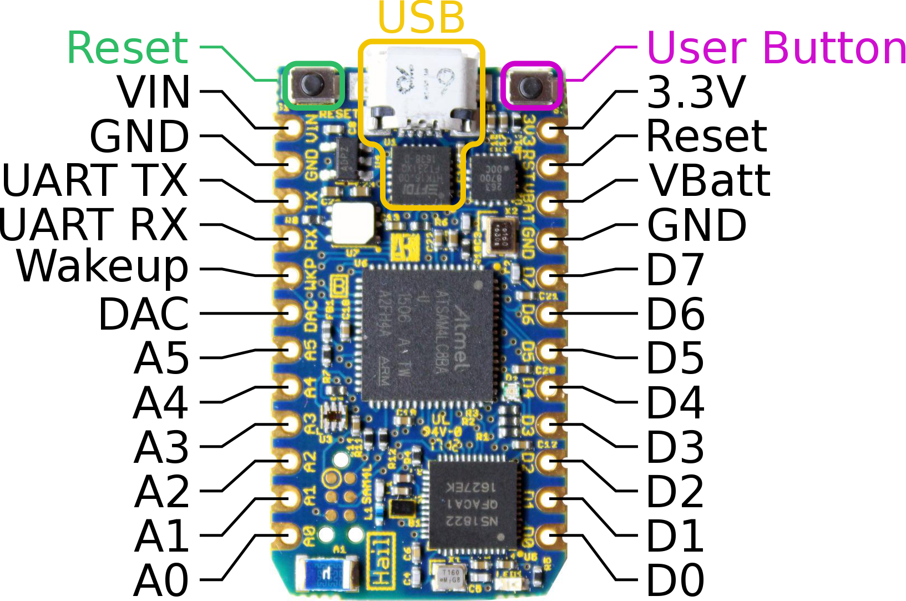

Hail
====

Hail is an IoT development module that runs the
[Tock](https://github.com/helena-project/tock) operating system.
Its features:

- [SAM4L](http://www.atmel.com/products/microcontrollers/arm/sam4l.aspx) Cortex-M4
- [nRF51822](https://www.nordicsemi.com/eng/Products/Bluetooth-low-energy/nRF51822) BLE Radio
- [SI7021](https://www.silabs.com/products/sensors/humidity-sensors/Pages/si7013-20-21.aspx) Temperature and Humidity Sensor
- [ISL29035](https://www.intersil.com/en/products/optoelectronics/ambient-light-sensors/light-to-digital-sensors/ISL29035.html) Light Sensor
- [FXOS8700CQ](http://www.nxp.com/products/sensors/6-axis-sensors/digital-sensor-3d-accelerometer-2g-4g-8g-plus-3d-magnetometer:FXOS8700CQ) 6-axis Accelerometer and Magnetometer
- RGB LED
- USB Programming
- Particle [Photon](https://www.particle.io/products/hardware/photon-wifi-dev-kit) Form-Factor and Pinout

**[Buy Now!](https://www.tockos.org/hardware/)**

Hail + Tock
-----------

[TockOS](https://github.com/helena-project/tock/tree/master/boards/hail)
supports Hail. See the instructions there for how to program the Tock kernel
and applications.

Bootloader
----------

Hail supports a software bootloader which allows new code to be flashed
over USB. The bootloader source is in the [bootloader](bootloader) directory.
The [tockloader](https://github.com/helena-project/tockloader) utility
can flash applications using the bootloader.

Commissioning New Hail Boards
-----------------------------

There a couple steps to provision a newly populated Hail board.
See the [commissioning](commissioning) folder for more information.

nRF51822 BLE Radio
------------------

By default, the nRF51822 is commissioned with the
[serialization](https://github.com/helena-project/tock-nrf-serialization)
application which allows softdevice commands to be sent over a UART connection
from the SAM4L.
